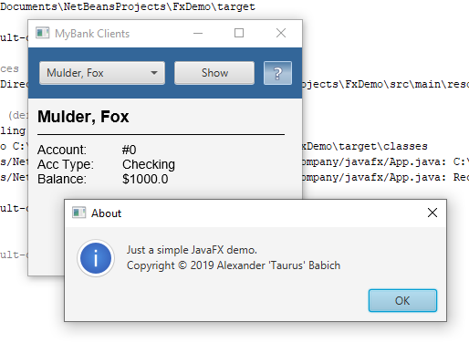
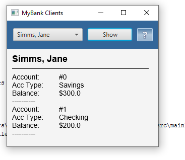
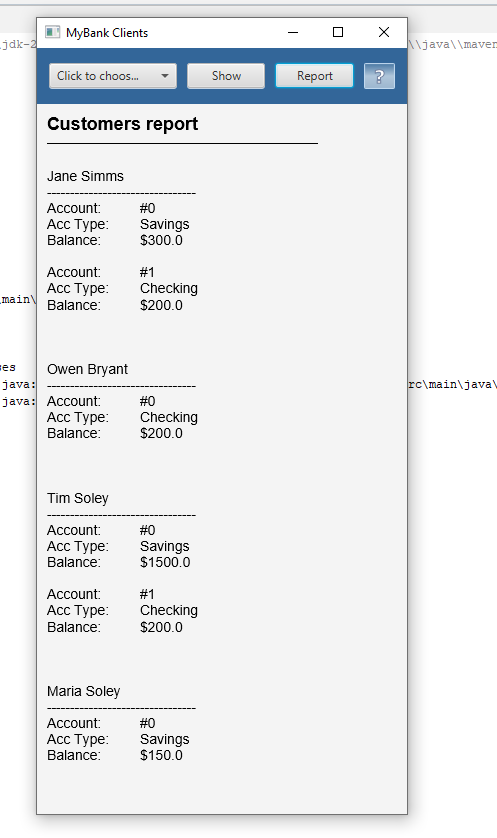

# UI Lab 5

Практичну виконала Жаботинська Софія, студентка 35 групи

[Посилання на код програми](src/FXDemo.java)

## Завдання на 3:

Запуск програми:

## Завдання на 4:

Читання і виведення інформації про клієнтів банку та їх рахунки з файлу [test.dat](data/test.dat).

## Завдання на 5:

Додавання до форми кнопки Report для створення звіту по клієнтам.

